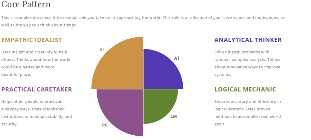

* Name : Michael McQuarrie
* Student Number : s3884359 
* Student Email : s3884359@student.rmit.edu.au

# Intro
I'm from New Zealand. I have studied video game development in NZ. I have previously lived in Japan. I used to play rugby league. I also trained in boxing, kickboxing, judo and Brazilian Jiu Jitsu. I enjoy watching combat sports including boxing, MMA, kickboxing, and sumo. I also enjoy watching rugby league and support the New Zealand Warriors. 

I started my interest in IT when I got my first game console. It was a SEGA master system 2. I was fascinated by how someone was able to create these games and how they worked. I studied video game development and have done some game work previously. I eventually moved to Australia and started another carer. While I was living abroad in Japan I decided I would like to move there permanently. One carer pathway that is very available to immigrants to Japan is IT. I decided to continue my studies in IT at RMIT so I could keep working and earning money while studying on the side. I hope to use my degree to move to another country and become a developer. Japan would be my preference as I already speak Japanese fairly well and have previously lived there.

## Ideal Job
 
https://rakuten.wd1.myworkdayjobs.com/en-US/RakutenInc/job/Tokyo-Japan/Mobile-App-Engineer-Android-Osaka-branch---ECID--Rakuten-Car-Service-_1003684-120

My ideal job would be a Mobile App Engineer. This job is providing updates for Rakuten's Car Service apps. The job requires knowledge of coding mobile apps and updating and improving user interfaces. This job interests me as it involves an app used in the sale of cars in Japan. Coding and designing taking into account the laws and regulations around vehicles in Japan interests me.

I have worked on mobile apps and have experience coding in a professional environment. I also have experience using agile methodology. The job is located in Japan and requires Japanese Language Proficient Test level 3(JLPT3). I am currently studying Japanese to acquire JLPT3 and hope to continue and acquire JLPT1.

## Myers-Briggs Test

My result in a Myers-Briggs test was Protagonist (ENFJ).  This type of person finds it natural to work together towards a common goal and is skilled at motivating people towards the goal. Protagonist's are not afraid to take up new challenges and push towards becoming better themselves. 

## Learning Style

I am a visual learner. This means I learn and remember things by sight. Visual Learners learn best when using methods that are primarily visual such as reading or pictures.

## Big 5 Personality test.
 

The Big 5 personality test shows that I am good at planning and using logic to work within systems and teams for the benefit of the business or project. This helps with seeing the bigger picture and making sure projects are finished on time and within budget. 

# Project Idea

## Overview

Snakes is a competitive video game. Players guide their snakes to eat pellets and avoid walls or other players. All player simultaneously play on the same board. There are 2-4 players competing each round. Each player guides their own snake over the internet or in person. Games should only last around 1-2 minute. Different boards will be available and randomly selected. 

## Motivation.

Snakes is interesting because while the game is easy to learn adding other players into the game adds more variables. As game rounds will only be 1-2 minutes long the mechanics of the game need to be as precise as possible. While coding the game itself wouldn't be difficult the design of levels, internet protocol,  and control scheme would be difficult to perfect. This is a challenge in user design rather than coding.

## Description

Players start at opposite ends of a square(see diagram 1). The snakes will then start moving forward.

 Diagram 1: 

Players cannot stop the forward movement. Players can turn their snake left or right and the snake will then continue to move. If a players snake hits a wall or another snake that player is eliminated and the game continues until 1 player is remaining. The final player remaining is the winner of that round. 

As players collect pellets their snake will grow. This will make it easier to eliminate other snakes. There will also occasionally be special pellets that are larger and glow. These will have special random effects such as reversing other players controls or shortening their snakes. 

There will be at least 3 levels. The first is the original square. This is the basic level with no special features. The second level will leave spaces open where the snakes enter the square. If a snake enters the space they will appear on the opposite side of the square. Players can use this to avoid others or entrap others. The third level will have 4 smaller squares inside the original square(see Diagram 2). If a snake enters one of these squares they will randomly exit either another square or one of the 4 sides. This is the most complex stage.

Diagram 2: 

## Tool and Technology.

The tools required for this project are an IDE such as eclipse or a game engine such as Unity. It will also require a multiplayer network engine to be able to play over the internet. This is included in Unity or RakNet is a multiplayer network engine that is free and available to the community on GitHub.

## Skills required.

The coding skills required to code the fundamental game play only requires basic coding ability but will require an understanding of the teams coding naming conventions and structures of game code. The multiplayer network engine will require learning how to use either RakNet or Unity's networking systems. The documentation is easily available but will require the most work and testing to implement internet multiplayer.

## Outcome.

If the project is successful the game can be released for free on Steam or hosted on a website such as IndieDB. This can be added to the team work portfolio and shows potential recruiters practical implementation of the skills required for programming jobs. 
